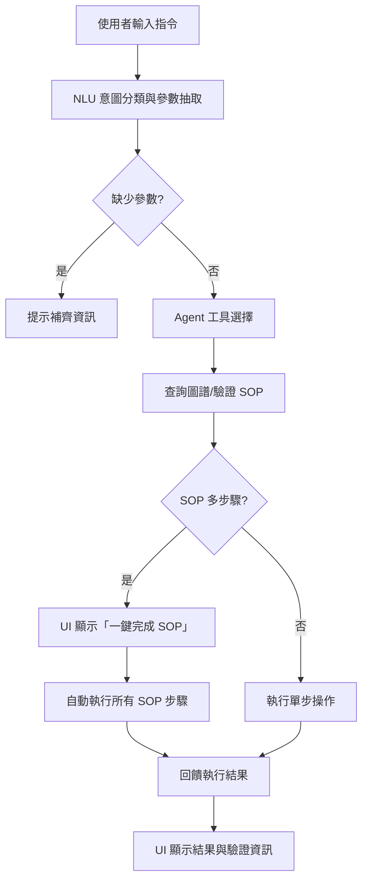

# TwinLex (GraphSOP)

## 1. 專案介紹
TwinLex (GraphSOP) 是一套針對智慧攝影機與工業設備的數位孿生知識建模與 SOP 控制平台。專案目標為將非結構化手冊、SOP、物理限制等資訊轉化為可查詢、可驗證的屬性圖譜，並結合 LLM 與多代理架構，實現自動化流程與安全規範檢查。

## 2. 框架設計
- **多 Agent 架構**：分工 @INFRA、@ARCH、@CODER、@ANALYST，對應數據、架構、提取、驗證等任務。
- **屬性圖譜 (Property Graph)**：以 Neo4j/NetworkX 為底層，結合 LlamaIndex 進行知識抽取與查詢。
- **Pydantic Schema 驗證**：所有 agent response 皆以 pydantic 類統一格式，確保前後端一致。
- **模組化設計**：分為 NLU、Agent、Logic、UI、Hardware、Schema、Ingestion 等子系統，易於擴展與維護。

## 3. 模組功能目標與介紹
- `src/agent/graph_agent.py`：多工具 agent，負責 SOP 查詢、控制、攝影機清單等。
- `src/schema/agent_response_model.py`：統一 agent response schema，型別安全。
- `src/ui/app.py`：Streamlit UI，支援自然語言指令、SOP 流程互動。
- `src/nlu/`：意圖分類、slot 提取、實體解析。
- `src/logic/`：流程驗證、guardrails、規則引擎。
- `src/hardware/`：MockCamera 與硬體介面模擬。
- `src/ingestion/`：知識抽取腳本，將手冊轉為圖譜。
- `docs/`：開發規範、手冊、Ontology、驗證清單等文檔。

## 4. 應用流程說明
1. 使用者於 UI 輸入自然語言指令（如「旋轉到 30 度」）。
2. NLU 模組解析意圖與參數，分流至對應 agent 工具。
3. agent 根據指令查詢圖譜、驗證 SOP，並回傳標準化 response。
4. 若 SOP 需多步驟，UI 支援「一鍵完成 SOP」自動執行所有步驟。
5. 執行結果與驗證資訊即時回饋於 UI。


## 5. 目錄結構
```
.
├── README.md
├── main.py
├── requirements_graphrag.txt
├── docker-compose.yml
├── docs/
│   ├── agent_context/
│   └── ...
├── src/
│   ├── agent/
│   │   ├── graph_agent.py
│   │   └── ...
│   ├── schema/
│   │   ├── agent_response_model.py
│   │   └── ontology.json
│   ├── ui/
│   │   └── app.py
│   ├── nlu/
│   ├── logic/
│   ├── hardware/
│   ├── ingestion/
│   └── ...
├── tests/
└── scripts/
```

## 6. 啟動導覽
1. 安裝依賴：`pip install -r requirements_graphrag.txt`
2. 啟動 Neo4j（如需）：`docker-compose up -d`
3. 啟動 UI：`streamlit run src/ui/app.py`
4. 依照 UI 指示輸入指令，體驗數位孿生 SOP 控制與查詢流程。