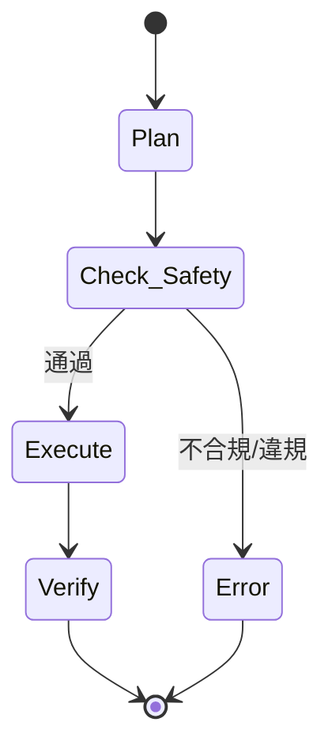

# TwinLex Phase 03 - LangGraph 狀態機設計（安全優先）

## 狀態機流程圖 (Mermaid)

## 節點說明

- **Plan**：根據 Intent 規劃 SOP 路徑（如 Unlock → Rotate → Zoom）。
- **Check_Safety**：查詢圖譜 Constraint，檢查 SOP 是否違反物理極限或安全規範（如角度超限、目標為 Privacy_Zone）。
    - 若違規，直接進入 Error 狀態，並回饋具體違規條款。
    - 若通過，進入 Execute。
- **Execute**：依 SOP 步驟執行實際操作。
- **Verify**：驗證執行結果（如狀態是否達標）。
- **Error**：流程異常或違規時進入，回饋錯誤訊息。

## 安全優先設計重點

- **Check_Safety** 必須在任何執行節點（Execute）之前。
- **失敗路徑**：Check_Safety 不通過時，必須能直接結束流程或進入 Error 狀態，並提供明確錯誤訊息。
- **流程閉環**：合法指令能完整流轉，違規指令能被100%攔截。
- **死鎖預防**：遇到異常時，皆可優雅轉移到 Error 狀態。